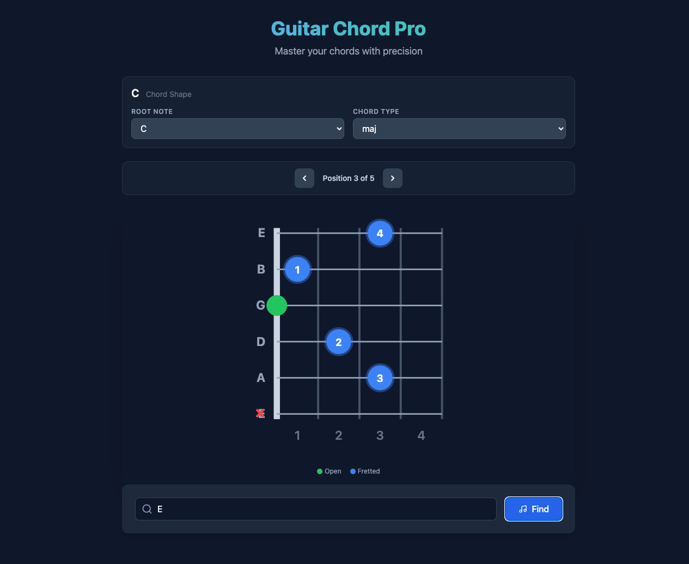

# Guitar Chord Pro

A modern, interactive guitar chord learning tool built with React and Vite. Visualize any guitar chord with a clear fretboard diagram, search your chord database, and master your chords with precision.



## Features

- **Interactive Fretboard** — Visualize chord shapes with color-coded finger placements:
  - 🔵 **Blue dots** — Fretted notes with finger numbers
  - 🟢 **Green dots** — Open strings
  - ❌ **Red X** — Muted strings (don't play)
  - 🔴 **Red bar** — Barre chord highlight (translucent red overlay across strings)

- **Root Note & Chord Type Selection** — Choose from all 12 root notes (A, A#, B, C, C#, D, D#, E, F, F#, G, G#) and 50+ chord types including:
  - Major, minor, 7th, sus2, sus4, dim, dim7, augmented
  - 6th, m6, 9th, m9, 11th, 13th, maj7, maj9
  - 7#9 (dominant 7th sharp 9), add9, madd9
  - Slash chords (e.g., C/A, G/B, E/G#)

- **Position Cycling** — Each chord can have multiple voicings across the fretboard. Navigate through all available positions using the Previous/Next arrows. See "Position X of Y" to know how many variations exist.

- **Smart Fret Numbering** — Fret labels at the bottom of the fretboard update dynamically:
  - Open-position chords show **1, 2, 3, 4** (standard open chord range)
  - Barre chords show **actual absolute fret numbers** (e.g., 4, 5, 6, 7)

- **Barre Chord Detection** — The fretboard automatically detects and highlights barre chords with a translucent red bar across the fretted strings.

- **Search Bar** — Quickly find any chord by name. Type partial names like "C", "G", "Am", "Bm7" and press Enter or click Find.

- **Clean Dark UI** — Easy on the eyes with a modern, responsive design using Tailwind CSS.

## Prerequisites

- **Node.js** (v18 or higher)
- **npm** (v9 or higher)

## Setup & Installation

1. **Clone the repository**

   ```bash
   git clone https://github.com/matt-dylan/guitar-chord-app.git
   cd guitar-chord-app
   ```

2. **Install dependencies**

   ```bash
   npm install
   ```

3. **Start the development server**

   ```bash
   npm run dev
   ```

   The app will open at `http://localhost:5173`

## Usage

### Selecting a Chord

1. Use the **Root Note** dropdown to choose the root (A through G#, including sharps)
2. Use the **Chord Type** dropdown to select the chord quality (maj, min, 7, sus2, etc.)
3. The fretboard updates instantly to show the chord shape

### Searching for a Chord

1. Type a chord name in the search bar at the bottom (e.g., "Cmaj7", "Dm9", "G/B")
2. Press Enter or click the **Find** button
3. The fretboard and dropdowns update to show your selected chord

### Cycling Through Positions

1. After selecting a chord, use the **Previous** (`<`) and **Next** (`>`) arrows to cycle through all available positions
2. The position counter shows "Position X of Y" (e.g., "Position 3 of 5")
3. Fret numbers and finger placements update for each position
4. Barre chord positions automatically show the red barre highlight

## Chord Data

Chord data is stored locally in `src/data/chords_db.json`. Each chord entry contains:

- **frets** — Array of fret positions per string (0 = open, -1 = muted, null = not applicable)
- **fingers** — Finger assignment for each string (0 = open, -1 = muted, 1-4 = finger number)
- **bars** — Barre chord information (fret and string range)
- **positions** — Array of different voicings/positions for the chord

## Project Structure

```
guitar-chord-app/
├── src/
│   ├── components/        # React components
│   │   ├── ChordSearch.jsx
│   │   └── Fretboard.jsx
│   ├── data/              # Chord database & config
│   │   └── chords_db.json
│   ├── services/          # API & data services
│   │   └── chordService.js
│   ├── App.jsx            # Main application component
│   └── main.jsx           # Entry point
├── public/                # Static assets
├── package.json
├── vite.config.js
├── tailwind.config.js
└── README.md
```

## Tech Stack

- **React 18** — UI framework
- **Vite 5** — Build tool & dev server
- **Tailwind CSS 3** — Utility-first styling
- **Lucide React** — Icon library

## License

This project is licensed under the [MIT License](LICENSE).
